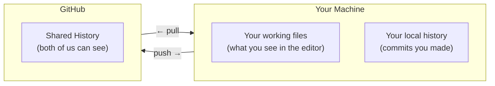

# Git Concepts

You don't need to learn Git commands — Claude Code handles that for you. But understanding what's happening underneath will help you make sense of things when Claude Code talks about commits, pushes, and pulls.

## What Git Is

Git is version control. It keeps a complete history of every change anyone makes to the project. Think of it like Google Docs version history, but for an entire folder of files.

Every change is saved as a **commit** — a snapshot of what changed, when, and why. You can always go back to any previous snapshot.

## The Mental Model

Picture three places your work exists:



- **Working files** — the actual files on your computer. What you edit.
- **Local history** — commits you've made but haven't shared yet.
- **GitHub** — the shared copy. When you push, your commits go here. When you pull, you get Dave's latest commits.

## Key Concepts

### Commit

A commit is a saved checkpoint. It records:

- Which files changed
- What changed in each file
- A short message describing why (e.g., "add fog forest dialogue")
- Who made the change and when

Commits are permanent history. You can always get back to any commit.

### Push

Pushing sends your local commits to GitHub so Dave can see them. Until you push, your work is only on your machine.

### Pull

Pulling gets the latest commits from GitHub — Dave's work, or your own work from another machine. Always pull before starting work and before pushing.

### The Staging Area

Before a commit, you choose which files to include. Claude Code handles this for you — when you say "commit my changes," it figures out which files you modified and stages them.

If you only want to commit some files, be specific: "commit just the lantern_clearing.json file."

## What's LFS?

Some files are too large for normal Git — images (PNG), audio (OGG, WAV), and fonts (TTF). Git LFS (Large File Storage) handles these transparently. You don't need to do anything special. Add an image to `assets/sprites/`, commit, push — LFS takes care of the rest.

The only thing to know: LFS files can't be merged. If you and Dave both change the same PNG (very unlikely given zone ownership), the last push wins. This is another reason we stay in our own zones.

## What's a Conflict?

A conflict happens when Git can't automatically combine two changes to the same file. For example:

1. You pull the latest version of a doc
2. You edit paragraph 3
3. Meanwhile, Dave also edited paragraph 3
4. You try to push — Git says "conflict"

Git marks the conflicting section in the file like this:

```
<<<<<<< HEAD
Your version of the text
=======
Dave's version of the text
>>>>>>> main
```

For files in your zone (dialogue, docs), you'll know which version is correct. The [cheat sheet](claude-code-cheatsheet.md#when-something-goes-wrong) walks you through resolving this with Claude Code. For files outside your zone, tell Dave.

## What You Don't Need to Know

These are real Git concepts that Dave uses, but you can safely ignore for now:

- **Branches** — we both work on `main`, so branching isn't part of your workflow
- **Rebasing** — an alternative to merging, Dave handles this if needed
- **Stashing** — temporarily shelving changes, Claude Code can do this if needed
- **Tags** — marking release versions, Dave's domain
- **Cherry-picking** — applying specific commits from one place to another

If you're curious about any of these, ask. But none of them are required for your daily work.
